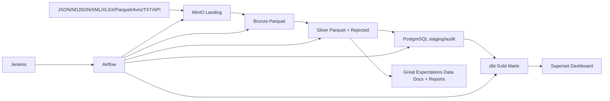

# Architecture

Raw procurement sources are generated locally, optionally uploaded to MinIO `landing`, converted into metadata-rich Bronze Parquet, standardized into Silver Parquet, loaded to PostgreSQL `staging`, modeled by dbt into `marts`, and queried by Superset. Airflow orchestrates the DAG and Jenkins validates CI/CD.

